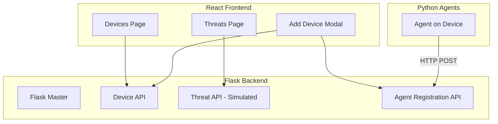

# CISO Campus Device Management Mockup - Implementation Plan

## Architecture Overview




---

## 1. Project Structure

```
final year project/
├── backend/                 # Flask master
│   ├── app.py
│   ├── requirements.txt
│   ├── models.py
│   └── api/
│       ├── devices.py
│       ├── threats.py
│       └── agents.py
├── agent/                   # Python agent (runs on managed devices)
│   ├── agent.py
│   └── requirements.txt
├── frontend/                # React app
│   ├── package.json
│   └── src/
│       ├── App.jsx
│       ├── components/
│       │   ├── DeviceList.jsx
│       │   ├── AddDeviceModal.jsx
│       │   ├── ThreatsPage.jsx
│       │   └── DeviceSelector.jsx
│       └── api/
│           └── client.js
└── README.md
```

---

## 2. Backend (Flask Master)

**Purpose:** Central API for devices, agent registration, and simulated threat scanning.

### Data Models (in-memory for mockup, SQLite-ready structure)

- **Device:** `id`, `name`, `type` (workstation/laptop/smart-board/cctv/iot), `source` (agent|manual), `ip`, `os`, `hardware` (cpu, ram_total_gb, ram_used_gb), `installed_apps[]`, `last_seen`, `agent_id` (optional)
- **ThreatScan:** `id`, `device_id`, `timestamp`, `status`, `results[]` (simulated CVE data)

### API Endpoints


| Method | Endpoint               | Description                                       |
| ------ | ---------------------- | ------------------------------------------------- |
| GET    | `/api/devices`         | List all devices                                  |
| POST   | `/api/devices`         | Add device (manual entry)                         |
| DELETE | `/api/devices/:id`     | Remove device                                     |
| PUT    | `/api/devices/:id`     | Update device                                     |
| POST   | `/api/agents/register` | Agent self-registration (HTTP)                    |
| POST   | `/api/threats/scan`    | Trigger simulated CVE scan for selected device(s) |
| GET    | `/api/threats`         | Get threat scan history/results                   |


### Simulated CVE Scan Logic

- Accept `device_ids[]` in request body
- Return mock CVE-style records: `cve_id`, `severity`, `description`, `affected_product`, `published_date`, `source` (mocked site names like nvd.nist.gov, cve.mitre.org)
- Randomize 0–5 mock entries per scan for demo variety
- Store scan history for display on Threats page

---

## 3. Python Agent

**Purpose:** Runs on devices that support agent installation; registers via HTTP to Flask backend.

- Lightweight script with `requests`
- **Collects and sends:**
  - **Hardware:** CPU (model, cores), RAM (total, used), hostname, IP
  - **Installed apps:** Platform-specific enumeration (see below)
- POST to `http://<flask-host>/api/agents/register`
- Optionally heartbeat/status ping on interval (can be minimal for mockup)
- `requirements.txt`: `requests`, `psutil` (cross-platform CPU/RAM)

### Agent Payload (POST body)

```python
{
  "hostname": "...",
  "ip": "...",
  "os": "Windows 11 / Ubuntu 22.04 / ...",
  "hardware": {
    "cpu": { "model": "Intel Core i7-12700", "cores": 12 },
    "ram_total_gb": 32,
    "ram_used_gb": 8
  },
  "installed_apps": ["Chrome 120", "VS Code", "Slack", ...]
}
```

### Collection Methods


| Data           | Linux                       | Windows                   | macOS                                                          |
| -------------- | --------------------------- | ------------------------- | -------------------------------------------------------------- |
| CPU            | `psutil` or `/proc/cpuinfo` | `psutil` or `wmic cpu`    | `psutil` or `system_profiler`                                  |
| RAM            | `psutil.virtual_memory()`   | same                      | same                                                           |
| Installed apps | `dpkg -l` / `rpm -qa`       | Registry + `wmic product` | `system_profiler SPApplicationsDataType` or `ls /Applications` |


For mockup: fallback to `platform` + mock values when a method fails (e.g. permission issues).

---

## 4. React Frontend

### Pages / Components

1. **Devices Page (main)**
  - Table/list of devices: name, type, source (Agent/Manual), IP, OS, hardware, software count
  - Actions: Edit, Delete
  - "Add Device" button → opens modal
2. **Add Device Modal**
  - Tabs or toggle: **"Agent Installation"** vs **"Manual Entry"**
  - **Agent:** Instructions + copy-paste curl/Python snippet to run agent; or "I've installed the agent" with device auto-appearing after refresh
  - **Manual:** Form fields: name, type dropdown (workstation, laptop, smart-board, cctv, iot), IP, OS, CPU (text), RAM (GB), installed apps (tags or comma-separated)
3. **Threats Page**
  - Device multi-select (which devices to scan)
  - **"New Scan"** button
  - Loading state during simulated scan
  - Results table: CVE ID, severity, description, affected product, source, date
  - Show last N scans with expandable results

### UI/UX Notes

- CISO-focused: clean, information-dense, severity badges (Critical/High/Medium/Low)
- Dark or professional light theme
- Responsive for admin use on desktop

---

## 5. Tech Stack Summary


| Layer    | Tech                                                           |
| -------- | -------------------------------------------------------------- |
| Frontend | React (Vite), fetch/axios for API calls                        |
| Backend  | Flask, Flask-CORS                                              |
| Agent    | Python 3, requests                                             |
| Data     | In-memory (list/dict) for mockup; easy to swap to SQLite later |


---

## 6. Key Implementation Details

### Agent Registration Flow

```
Agent (on device) → POST /api/agents/register
  Body: { hostname, ip, os, hardware: { cpu, ram_total_gb, ram_used_gb }, installed_apps[] }
Flask → Creates/updates Device with source="agent", stores hardware + installed_apps
Frontend → Poll or refresh devices list to show new device
```

### Manual Entry Flow

```
User fills form → POST /api/devices
  Body: { name, type, ip, os, hardware: { cpu, ram_gb }, installed_apps[] }
Flask → Creates Device with source="manual"
```

### Simulated Threat Scan Flow

```
User selects device(s) → Clicks "New Scan" → POST /api/threats/scan
  Body: { device_ids: [1,2,3] }
Flask → Generates 0–5 mock CVE entries per device
      → Returns + stores in scan history
Frontend → Displays results, updates scan history list
```

---

## 7. Mock CVE Data Structure (Simulation)

```python
# Example mock CVE record
{
  "cve_id": "CVE-2025-XXXX",
  "severity": "HIGH",
  "description": "Mock vulnerability in [product]",
  "affected_product": "Windows 11 / Smart Board 800",
  "published_date": "2025-02-15",
  "source": "nvd.nist.gov"
}
```

---

## 8. Execution Order

1. Scaffold Flask backend with CORS, models, device CRUD
2. Add agent registration endpoint and Python agent script
3. Add threats API (simulated scan + history)
4. Scaffold React app with Vite, routing (devices + threats)
5. Implement Devices page, Add Device modal (both flows)
6. Implement Threats page with New Scan and results display
7. Wire API client and polish styling

